# 시계열 모델 개요

## 1. 정상 프로세스 
시간과 관계 없이 평균과 분산이 일정한 시계열 데이터
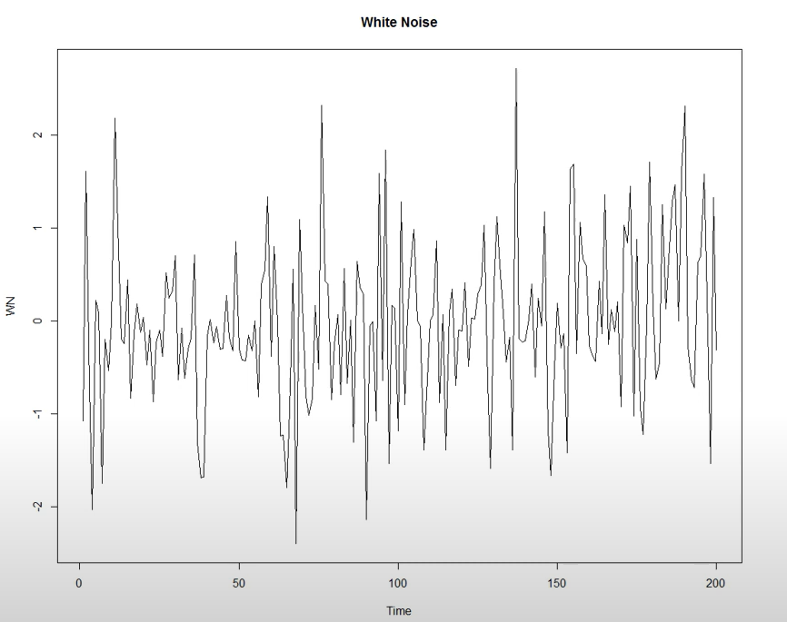

### 정상성 판단 방법
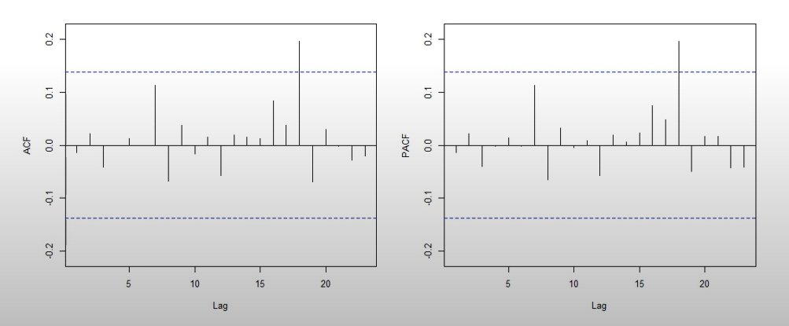
1. ACF(Auto Correlation Function)
- x: lag
- y: auto correlation
- Lag 1: 현 시점과 한 시점 미룬 데이터와의 상관관계

2. PACF(Partial ACF)
- 부분 자기상관 함수

위 두가지 plot을 그리고 특정한 패턴 없이 랜덤하게 나타나는 경우, 정상성(stationary)을 가진다고 판단. 

### 비정상성 예시
1. ACF가 일정하게 천천히 줄어드는 경향
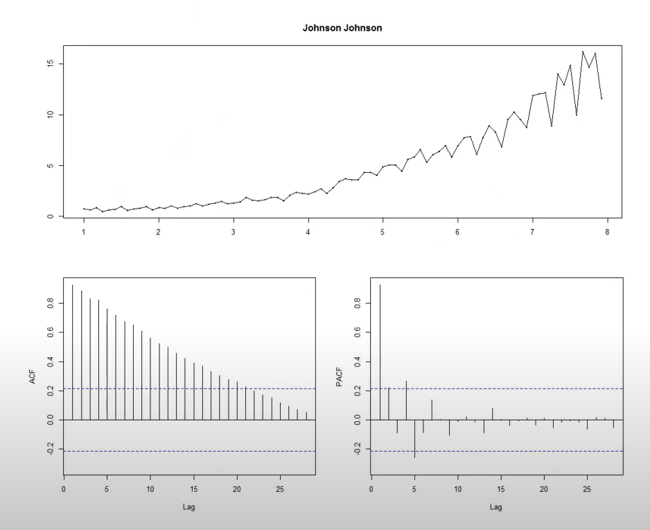

2. 떨어졌다가 오르지만 전반적으로 떨어짐
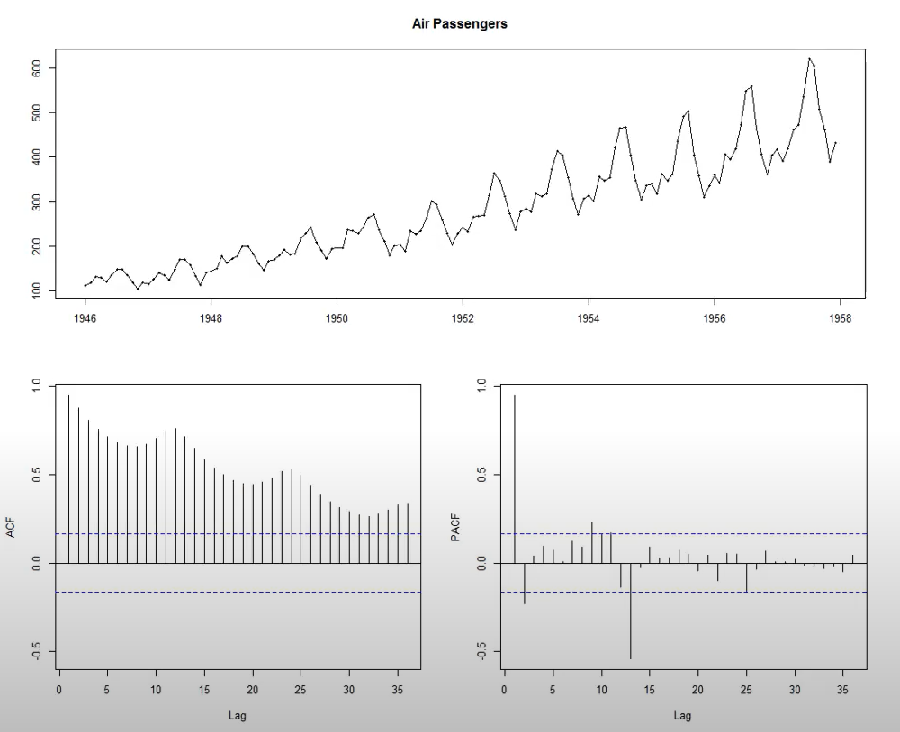

## 2. 모델링
### (1) Autoregressive(AR) Models
t시점의 Y 값을 자기 자신의 과거 값(Lag)들로 모델링

$$y_t=\emptyset_0+\emptyset_1 y_{t-1}+\emptyset_2 y_{t-2}+\ldots+\emptyset_p y_{t-p}+\varepsilon_t$$

multiple regression 모델과 다름
- 독립성이 없음 (자기 자신을 이용하여 모델링)
- 최소제곱법(OLS)으로 파라미터 추정 불가

### (2) Moving Average(MA) Models
t시점의 데이터를 과거의 오차(에러) 항으로 모델링

$$y_t=\theta_0+\varepsilon_t+\theta_1 \varepsilon_{t-1}+\theta_2 \varepsilon_{t-2}+\ldots+\theta_q \varepsilon_{t-q}$$

### (3) Autoregressive and Moving Average(ARMA)
- AR과 MA 모델을 결합한 모델
    - t시점의 y를 자기 자신에 lag된 값들과 t 시점과 그 전 시점의 에러들을 가지고 표현하겠다.

$$y_t=\emptyset_0+\emptyset_1 y_{t-1}+\emptyset_2 y_{t-2}+\cdots \emptyset_p y_{t-p}+\varepsilon_t+\theta_1 \varepsilon_{t-1}+\theta_2 \varepsilon_{t-2}+\ldots+\theta_q \varepsilon_{t-q}$$

### (4) Autoregressive Integrated Moving Average(ARIMA)
- stationary를 secure하기 위해 differencing(차분) 후 진행
    - 위의 세 모델을 분석하기 위해서는 데이터가 stationry해야 한다.
    - non-stationaryㄹ면 stationary하게 바꾸기 : 이 방법이 differencing
- differencing했다 = integrated 헸다
    - I :  differencing을 몇 번 했는지
- ARIMA(p,d,q) 모델
    - p: AR(자기회귀) 파라미터 개수
    - d: 차분 횟수 (Differencing)
    - q: MA(이동평균) 파라미터 개수

#### 차분
origianl data가 non-stationary일 때 stationary로 바꾸는 방법
- 1차 차분: $Y_t=X_t-X_{t-1}=\nabla X_t$
- 2차 차분: $Y_t^{(2)}=X_t-X_{t-2}=\nabla^{(2)} X_t$
- d차 차분: $Y_t^{(d)}=X_t-X_{t-d}=\nabla^{(d)} X_t$

현재 데이터와 d 시점 이전 데이터와의 차이

원본 데이터의 패턴에 따라 차분 횟수 결정
- 정상성 데이터: 차분 불필요
- 일정한 증가/감소: 1차 차분 필요
- 복잡한 트렌드: 2차 차분 필요 (일반적으로 충분함)
- 보통 2차 차분으로 충분

예시
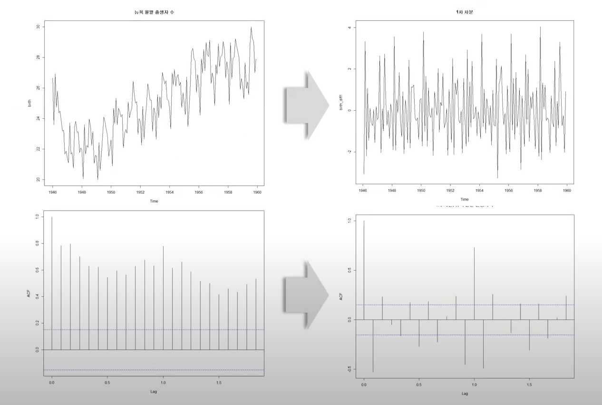
- 1차 차분 후 정상성을 확보

### (5) Box-Jenkins ARIMA Procedure
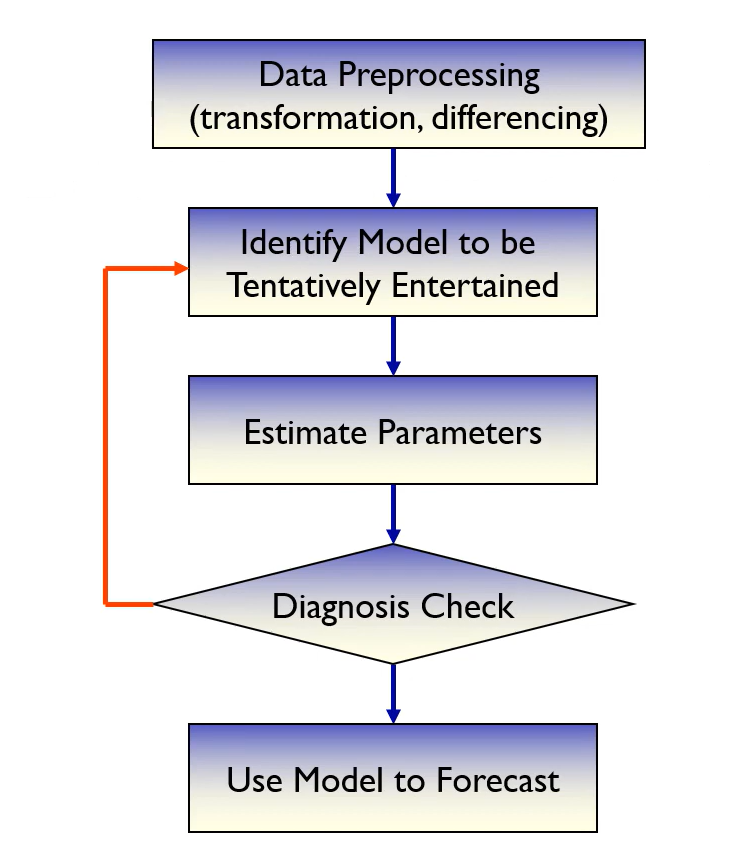
1. 데이터 전처리
    - ACF 플롯을 확인하여 정상성 여부 판단
    - Lag=0일 때 항상 1
    - lag1 일 때부터 천천히 떨어짐 -> non-stationary
    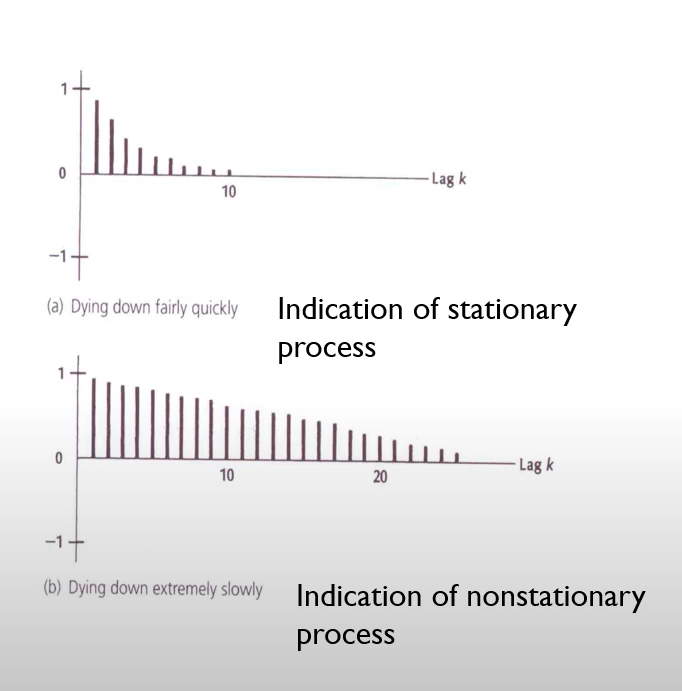

2. 시범 모델 선정
    - 그래프를 이용한 주관적 모델 선택
    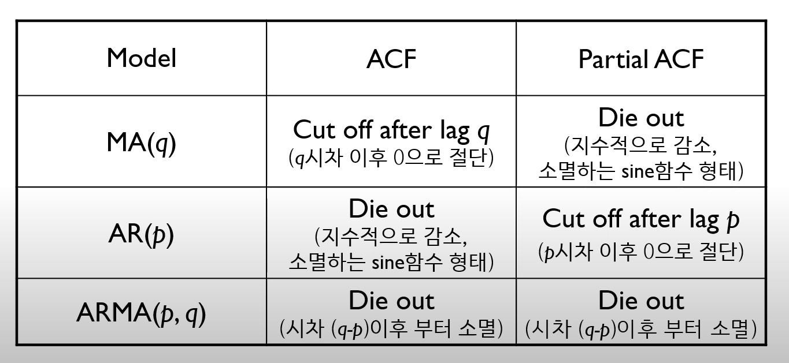
    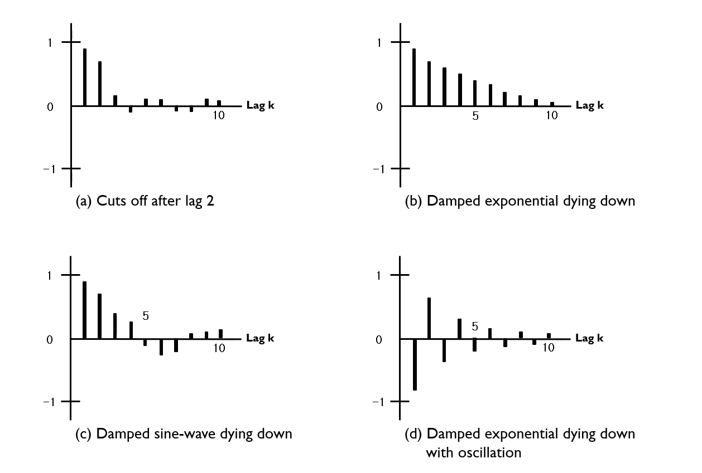
        - Cut off: 급격히 감소 → 1번
        - Die out: 천천히 감소 → 2,3,4번

3. 파라미터 추정
    - AIC (Akaike Information Criterion) 최소화
    - 주변 모델과 비교하여 최적 모델 선정

4. 모델 체크
    - 모델과 파라미터가 적절한지 확인
    - 잔차(Residual)를 이용한 ACF 플롯 분석
    - 대부분의 값이 신뢰구간 내에 있으면 적절한 모델
5. 예측

### (6) Seasonal ARIMA Model(SARIMA)
- ARIMA 모델에 계절 변동성을 추가한 모델
- 계절 주기를 나타내는 s를 포함하여 모델링

SARIMA(p,d,q)(P,D,Q,s) 모델
- (p,d,q): 일반 ARIMA 모델의 파라미터
- (P,D,Q,s): 계절성(Seasonality) 반영 파라미터
    - P: 계절성 자기회귀(AR) 파라미터 개수
    - D: 계절성 차분 횟수
    - Q: 계절성 이동평균(MA) 파라미터 개수
    - s: 계절 주기

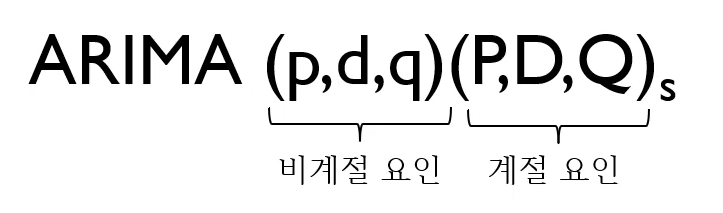
- 계절성을 포함하여 총 7개의 파라미터 존재

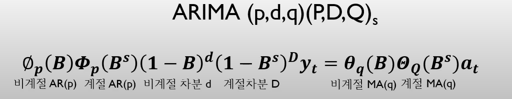

### (7)  Vector Autoregressive (VAR) Model
VAR 모델은 여러 시계열 변수들이 서로 영향을 미친다고 가정하는 모델
- 각 변수는 자기 자신과 다른 변수들의 과거 값들을 이용하여 예측
- 여러 시계열 데이터를 동시에 분석할 수 있는 방법을 제공

$$
\mathbf{y_t} = \mathbf{c} + \sum_{i=1}^{p} \mathbf{A_i} \mathbf{y_{t-i}} + \mathbf{\varepsilon_t}
$$

- $y_t$: 시점 $t$에서의 모든 변수들의 벡터
- $c$: 상수 벡터
- $A_i$: 각 시차의 자기회귀 계수 행렬
- $p$: 모델의 차수(시차)
- $\epsilon_t$: 잔차 벡터 (오차 항)

VAR 모델의 특징
- 다변량 시계열 모델
    - 하나의 변수만을 고려하는 AR 모델과 달리 VAR 모델은 여러 시계열 변수 간의 상호 관계를 분석
- 선형성
    - 각 변수의 현재 값은 자기 자신의 과거 값뿐만 아니라 다른 변수들의 과거 값에 의해서도 영향을 받음
- 순차적 예측
    각 시점의 값은 이전 시점들에 대한 정보를 통해 예측됨

참고 자료
https://www.youtube.com/watch?v=ma_L2YRWMHI
https://www.youtube.com/watch?v=P_3808Xv76Q

