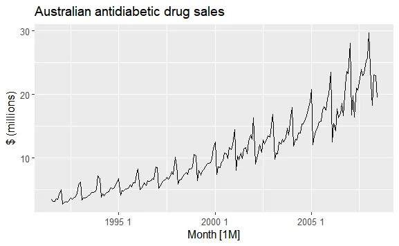
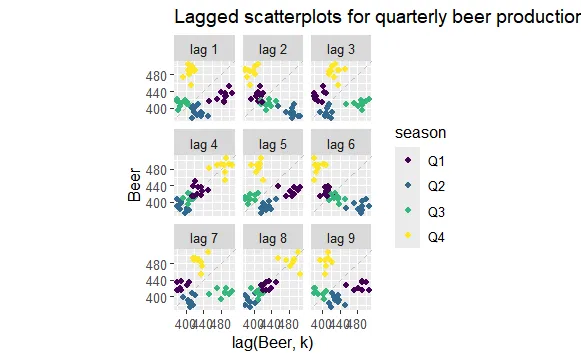
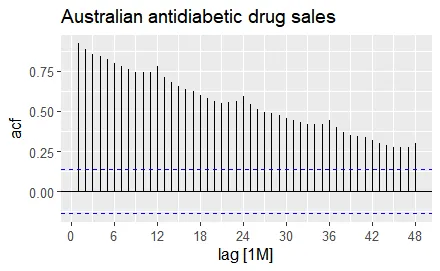
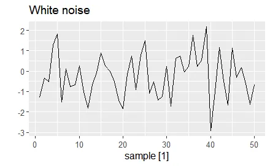
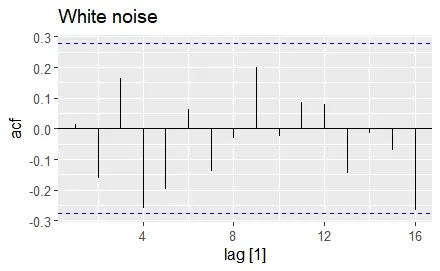
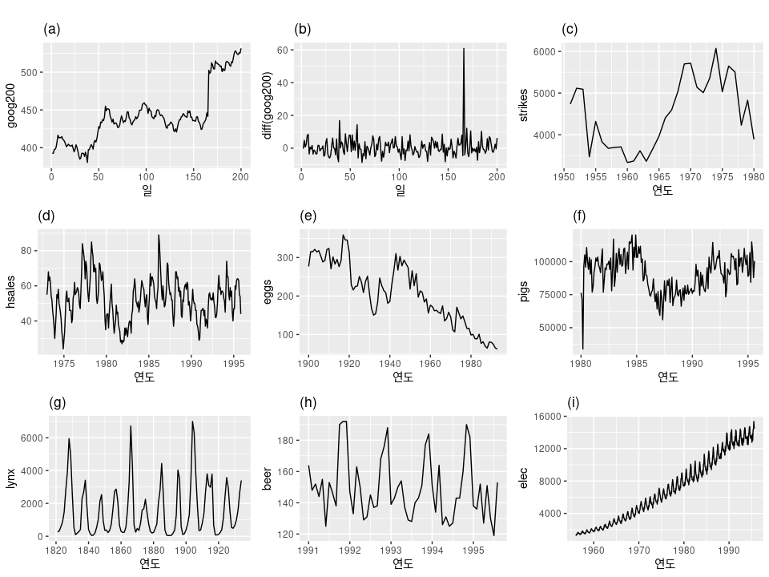
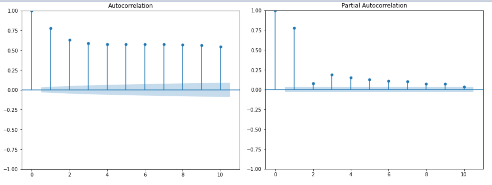
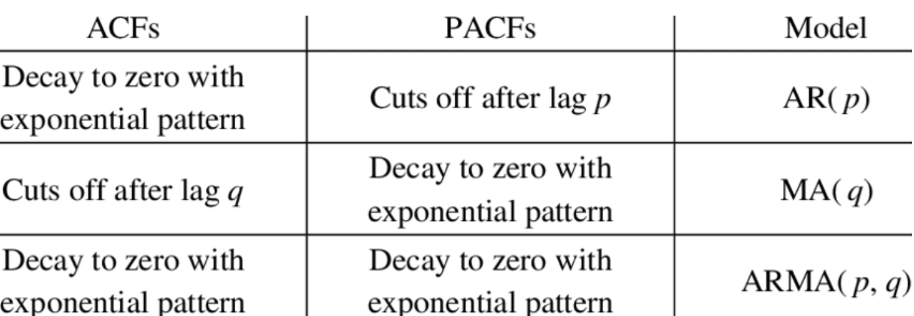
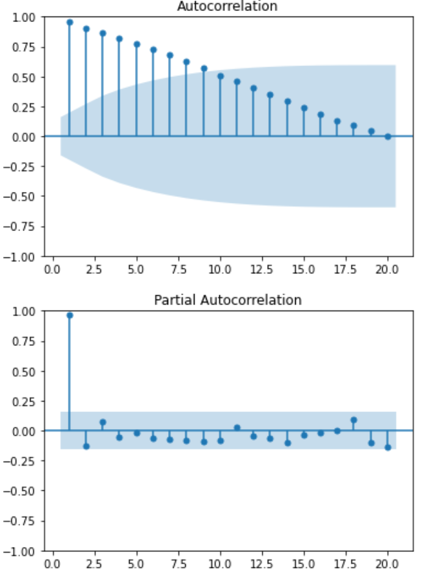
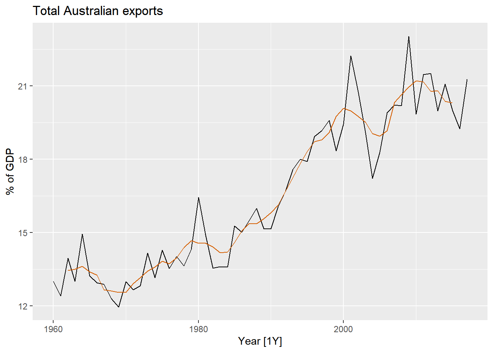

# 시계열 데이터 처리
## 목차
- **[1. 시계열 데이터](#1-시계열-데이터)**
  - [1.1 시계열 데이터란](#11-시계열-데이터란)
  - [1.2 시계열 데이터의 구성 요소](#12-시계열-데이터의-구성-요소)
  - [1.3 시계열 데이터 분석 방법론](#13-시계열-데이터-분석-방법론)

- **[2. 시계열 데이터의 시각화](#2-시계열-데이터의-시각화)**
  - [2.1 시차 그래프(Lag Plot)](#21-시차-그래프lag-plot)
  - [2.2 자기상관성과 부분 자기상관성](#22-자기상관성과-부분-자기상관성)
  - [2.3 백색소음(White Noise)](#23-백색소음white-noise)

- **[3. 정상성과 비정상성](#3-정상성과-비정상성)**
  - [3.1 정상성(Stationarity)](#31-정상성stationarity)
  - [3.2 정상성 검정 방법](#32-정상성-검정-방법)
  - [3.3 정상성을 만드는 방법](#33-정상성을-만드는-방법)

- **[4. 시계열 데이터 변환 및 분해](#4-시계열-데이터-변환-및-분해)**
  - [4.1 이동 평균(Moving Average)](#41-이동-평균moving-average)
  - [4.2 시계열 분해(Time Series Decomposition)](#42-시계열-분해time-series-decomposition)
- [참고 자료](#참고-자료)

## 1. 시계열 데이터
### 1.1 시계열 데이터란?
- 하나의 변수를 시간에 따라 여러 번 관측한 데이터
- 가격, 매출, 온도, 성장 등 변화 예측과 반복되는 패턴에 대한 인사이트 도출을 목표로 함
  - 단순히 값뿐만 아니라 변동성 등에 대한 다양한 예측 가능
- 시간 또는 회차 단위, 시간 t는 절대적인 순서가 중요한 데이터이므로 t는 고정하고 변수들의 여러 요인에 대해 분석하는 것이 일반적
- 시계열 데이터 예시

### 1.2 시계열 데이터의 구성 요소
- **추세(trend)**: 장기적인 증가 또는 감소
- **계절성(seasonality)**: 특정 요일/계절에 따라 일정한 주기로 반복되는 패턴
- **주기(cycle)**: 고정된 빈도가 아니지만 형태적으로 유사하게 나타나는 패턴
- **노이즈(noise)**: 측정 오류, 내부 변동성 등 다양한 요인으로 생기는 불규칙적인 변동

⇒ 시계열 데이터는 추세, 계절성, 주기, 노이즈를 모두 포함하며, 적절한 예측 방법을 선택하려면 이러한 패턴을 먼저 분석해야 한다.

### 1.3 시계열 데이터 분석 방법론
- **가법 모델(Additive Model)**: 시계열 데이터 = 추세 + 계절성 + 주기 + 노이즈
- **승법 모델(Multiplicative Model)**: 시계열 데이터 = 추세 × 계절성 × 주기 + 노이즈

시간에 따라 변동폭이 비교적 일정하다면 가법 모델을, 변동폭이 커진다면 승법 모델을 사용한다.

## 2. 시계열 데이터의 시각화 및 탐색
### 2.1 시차 그래프(Lag Plot)
- Lag는 시계열 데이터에서 시간 차이를 의미
- 즉, 특정 시점의 값과 이전 시점의 값 사이의 시간 간격을 말한다.
    - 예를 들어, Lag 1은 t 시점의 값과 t-1 시점의 값 사이의 차이를 의미.
    -  마찬가지로 Lag 2는 t 시점과 t-2 시점의 값 간의 차이를 나타냄.

LAG 그래프
- 자기상관성을 직관적으로 확인하기 위해 시차를 두고 산점도를 그린 그래프
- 특정 패턴이 나타나면 자기상관성이 존재하는 것으로 판단
- 그래프 예시

    - lag1의 그래프: 시간 간격이 1인 것들을 모아서 그려둔 그래프
    - lag4와 8에서 선형성이 보인다(lag4는 1년) -> 계절성이 존재한다.

- 계절성을 확인하는 데 지연 그래프가 유용하게 활용될 수 있다.

### 2.2 자기상관성과 부분 자기상관성
- **자기상관성(Autocorrelation)**: 과거 값과 현재 값 사이의 상관 관계
    $$r_k = \frac{\sum_{t=k+1}^{T} (y_t - \bar{y})(y_{t-k} - \bar{y})}{\sum_{t=1}^{T} (y_t - \bar{y})^2}$$
- **ACF(자기상관 함수, Autocorrelation Function)**: 특정 시차별 자기상관 계수를 계산
- ACF 그래프 예시

- **PACF(부분 자기상관 함수, Partial Autocorrelation Function)**: 특정 시차에서 직접적인 상관성을 측정
- **활용**:
  - ACF와 PACF 그래프를 통해 AR(자기회귀) 및 MA(이동평균) 모델의 차수 결정
  - 정상성을 확인하고 적절한 변환(차분 등) 적용

### 2.3 백색소음(White Noise)
- 자기상관성이 없는 무작위 데이터
- 평균이 일정하고 분산이 변하지 않으며 자기상관이 존재하지 않음
- 그래프 예시

- 백색 소음의 ACF 그래프

    - 자기상관 값이 모두 0에 가까움.
    - 이론적으로 ACF 값의 95%가 범위 ±1.96 / sqrt(50) ≈ ±0.28 내에 존재해야 한다.
    - 모든 ACF 값이 해당 범위 내에 포함되므로, 이는 백색 잡음 데이터임을 확인할 수 있다.
    - 파란 선 안에 있음 -> 통계적으로 유의하지 않다 -> 랜덤하다, 자기 상관성을 볼 수 없다.

## 3. 정상성과 비정상성
### 3.1 정상성(Stationarity)
- 정상성: 시간에 따라 통계적 특성이 변하지 않는 경우
- 비정상성: 시간에 따라 통계적 특성이 변하는 경우
- 통계적 특성 예시: 평균, 분산, 공분산

따라서, 추세나 계절성이 있는 시계열은 정상성을 나타내는 시계열이 아니다.
- 시간의 추이오 관계 없이 다음 세 가지가 일정해야 한다.
    - (1) 평균, (2) 분산, (3) 자기공분산
- 시계열 데이터가 비정상성을 띤다면 평균과 분산이 다르기 때문에 임의의 시점 t-1, t에서 얻은 모델은 t+1~t+n에서 사용할 수 없게 되기 때문에 정상성을 판단하는 것은 중요하다.

### 3.2 정상성 검정 방법
- **시각적 방법**: 시계열 플롯, ACF/PACF 그래프 확인
    - 시계열 플롯
    
        - 9개의 그래프 중 정상성을 나타내는 그래프는 (b)와 (g) 뿐이다.
    - ACF, PACF
        - ACF: 자기 상관 함수
            - 상관 값이 빠르게 0으로 줄어들면, 즉 전의 값과 연관이 없으면 정상성을 띤다고 볼 수 있음.
            
        - PACF: 두 시점 내의 구간 값을 고려하지 않고 구 시점의 상관관계 확인
        - 그래프
              
            - ACF(왼쪽): correlation이 내려가는 것을 볼 수 있지만 느리게 감소하며 신뢰구간에는 전혀 들어가지 못하는 모습 -> 비정상적
            - PACF(오른쪽): 시차 1까지 상관이 높은 것을 확인
        - 위 그래프들에서 확인 값으로 모형 결정 가능
        
        - (예시)
        
            - ACF를 보면 값이 빠른 속도로 범위 안으로 들어가고 있고 PACF는 1 이후에 범위 안으로 들어간 것을 보면 AR(1) 모델을 활용하는 것이 적합하다고 판단할 수 있음.
- **통계적 방법**:
  - 단위근 검정(Unit Root Test)
    - 단측 검정이며 귀무가설은 'H0: 비정상성을 띤다. δ=0'로 p-value가 유의수준 0.05보다 작아 귀무가설을 기각하고 대립가설을 채택해야 정상성을 띠는 것
    - ADF(Augmented Dickey-Fuller) 테스트
    - KPSS(Kwiatkowski-Phillips-Schmidt-Shin) 테스트
    - Dicky_Fuller 검정
  - 단위근 검정 후 비정상성을 띄면 차분을 고려하면 됨.

### 3.3 정상성을 만드는 방법
- **차분(Differencing)**: 이웃한 두 값의 차이를 계산하여 비정상성을 제거
  - [1,2,4,7,8,10] → [None,1,2,3,1,2]
  - 계절성이 있는 경우 계절 차분도 사용 가능
  - 2차 차분도 가능
- **변환(Transformation)**: 로그 변환, 제곱근 변환 등을 활용하여 분산 안정화
- **평활(Smoothing)**: 이동평균 등을 이용해 노이즈 제거

## 4. 시계열 데이터 변환 및 분해
### 4.1 이동 평균(Moving Average)
- 급격하게 변하는 값을 부드럽게 만들어 추세를 파악하기 쉬움
$$ \hat{T_t} = \frac{1}{m} \sum_{j=-k}^{k} y_{t+j} $$
이때, $m=2k+1$

- 이동 평균을 취하면 무작위 변동을 줄이고 부드러운 추세-순환 성분을 남길 수 있음.
- 예시 그래프 - 5MA

    - 앞에 두개/뒤에 두개는 NA라서 안 그려짐.(앞에 값이 없으니까!)
- 일반적으로 홀수 차수 사용
    - 짝수 차수는 대칭이 안 맞음.

- 짝수 차수의 경우 **이동 평균의 이동 평균**을 적용함
    - 중심 이동 평균
    $$ \hat{T_t} = \frac{1}{2} [ \frac{1}{4} (y_{t-2} + y_{t-1} + y_t + y_{t+1}) + \frac{1}{4} (y_{t-1} + y_t + y_{t+1} + y_{t+2}) ] $$
    - 이렇게 계산하면 대칭적인 가중 평균이 됨.
    - **이동 평균 조합의 일반적인 규칙**
        -  짝수 차수의 이동 평균 → 또 다른 짝수 차수 이동 평균을 적용해야 대칭적
        - 홀수 차수의 이동 평균 → 또 다른 홀수 차수 이동 평균을 적용해야 대칭적
- **가중 이동 평균(Weighted Moving Average, WMA)**: 가중치 적용

    $$\hat{T_t} = \sum_{j=-k}^{k} a_j y_{t+j}$$

    - 가중 이동 평균의 장점
        - 가중 이동 평균의 가장 큰 장점은 추세-순환(trend-cycle) 추정값이 더 부드럽다는 것.
        - 단순 이동 평균에서는 데이터가 계산에 포함될 때 100% 반영되었다가, 다음 단계에서 완전히 사라짐. 
        - 하지만 가중 이동 평균에서는 점진적으로 가중치가 증가하고 감소하므로, 더 부드러운 곡선(smoother curve)을 얻을 수 있음.
- **지수 이동 평균(Exponential Moving Average, EMA)**: 최근 데이터에 더 높은 가중치를 부여

### 4.2 시계열 분해(Time Series Decomposition)
시계열 데이터를 추세, 계절성, 잔차로 나누어 분석할 수 있도록 함.
- **STL 분해(Seasonal-Trend Decomposition using LOESS)**
    - LOESS 기법을 사용해 시계열 데이터를 추세, 계절성, 잔차로 분리.
    - 장점: 비선형적 패턴을 처리할 수 있어 복잡한 시계열에 유용함.
    - 활용 예시: 판매 데이터, 웹 트래픽 분석 등.
- **HP 필터(Hodrick-Prescott Filter)**
    - 시계열 데이터를 장기적인 추세와 단기 변동성으로 나눔.
    - 장점: 경제 데이터에서 장기 추세를 추출할 때 유용함.
    - 활용 예시: GDP, 물가 상승률 등 경제 지표 분석.

## 참고 자료

- https://otexts.com/fppkr/
- https://velog.io/@phs5145/%EC%8B%9C%EA%B3%84%EC%97%B4-%EC%A0%95%EC%83%81%EC%84%B1%EA%B3%BC-%EB%B9%84%EC%A0%95%EC%83%81%EC%84%B1
- 추가로 보면 좋을 것: 
    - [시계열 이상치 탐지](https://velog.io/@nameunzz/Anomaly-Detection)
    - [시계열 인과관계](https://velog.io/@euisuk-chung/%EA%B0%9C%EB%85%90%EC%A0%95%EB%A6%AC-%EC%8B%9C%EA%B3%84%EC%97%B4-%EB%B6%84%EC%84%9D-%EC%9D%B8%EA%B3%BC%EA%B4%80%EA%B3%84-%EB%B6%84%EC%84%9D)