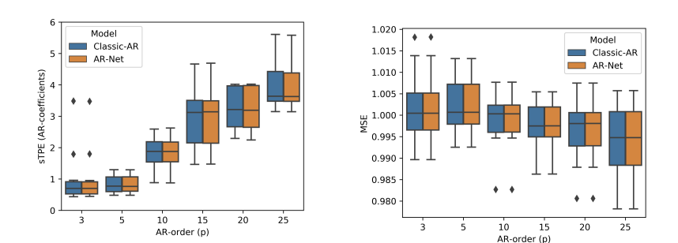
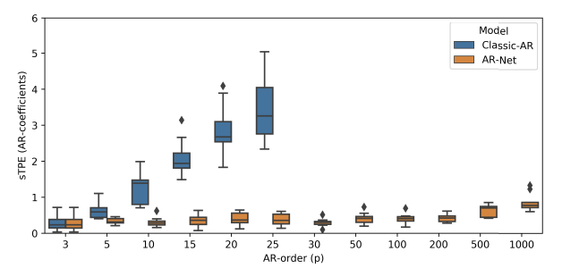
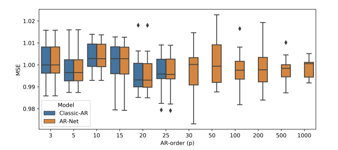
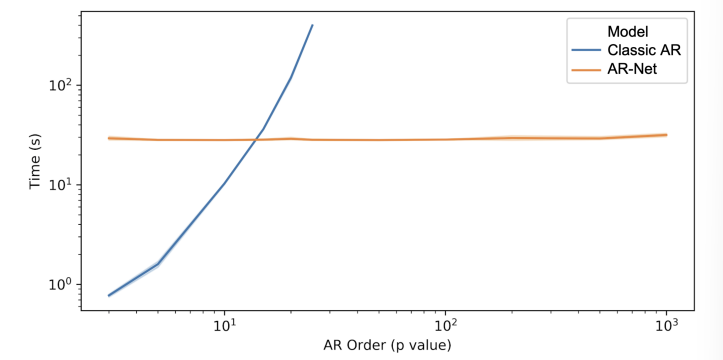

# 📄 [AR-Net: A simple Auto-Regressive Neural Network for time-series](https://arxiv.org/pdf/1911.12436)

논문 리뷰 가보자고! 
## 🚀 목차
- [ABSTRACT](#📌-abstract)
- [1. Introduction](#1️⃣-introduction)
- [2. Related Work ](#2️⃣-related-work)
- [3. Methods](#3️⃣-methods)
    - [3.1. Data](#📊-31-data)
    - [3.2. Classic-AR model](#🔹-32-classic-ar-model)
    - [3.3. AR-Net Model](#🔥-33-ar-net-model)
        - [3.3.1. sparse-AR-Net](#🏆-331-sparse-ar-net)
    - [3.4 Metrics](#📏-34-metrics-성능-평가-지표)
- [4. Results](#4️⃣-results)
    - [4.1. Learning AR-Coefficients](#🔥-41-learning-ar-coefficients)
        - [4.1.1. Sparse AR Coefficients for Unknown \( p \)-order](#411-sparse-ar-coefficients-for-unknown--p--order-🧩)
        - [4.1.2. Computational Performance](#412-computational-performance-⚡)
- [5. Conclusion](#5️⃣-conclusion)

---

## 📌 ABSTRACT  

이 논문에서는 **전통적인 통계 모델**과 **신경망**의 장점을 결합한 새로운 시계열 모델인 AR-Net을 제안한다.  

- 📊 **Classic AR 모델**  
    - ✅ Least squares를 이용한 피팅  
    - ✅ 장점: 간결하고 해석 가능  
    - ❌ 단점: 장기 의존성을 다룰 때 계산 비용이 너무 큼  

- 🧠 **RNN**  
    - ✅ 장점: 시계열 데이터를 다룰 수 있음  
    - ❌ 단점: 복잡도가 높고 해석이 어려움  

🔹 **➡ AR-Net 제안!**  
- AR 모델을 신경망 구조로 변형한 모델  
- 해석 가능성을 유지하면서도 확장성을 높인 것이 특징  
- 🔍 **세 가지 핵심 결론**  
    - (1) Classic-AR과 동일한 해석 가능성 ✅  
    - (2) 계산 비용이 **O(\(p\))로 선형 증가**하여 장기 의존성 효율적 모델링 💡  
    - (3) 정규화를 통해 **자동으로 AR 계수를 선택하고 학습 가능**, 즉 AR 차수를 몰라도 모델 학습 가능 🤖  

---

## 1️⃣ Introduction  
📌 시계열(time-series) 데이터를 다룰 때, 전통적인 Auto-Regressive (AR) 모델과 딥러닝을 결합한 새로운 방법을 제안  

- 🔹 **Auto-Regression (AR)**  
    - 과거 데이터를 기반으로 미래를 예측  
    - 간결하고 해석 가능성이 높음  
    - ❌ 하지만 AR 차수 \( p \)가 커질수록 계산 속도가 급격히 느려지는 문제가 있음  

- 🔹 **Neural Networks (NN)**  
    - 장기 의존성 학습 가능  
    - ❌ 과적합, 낮은 해석 가능성, 복잡한 구조  

➡ **결론:** AR-Net을 제안하여, **AR 모델의 해석 가능성과 딥러닝의 확장성을 결합한 효율적인 모델**을 만들고자 함.  

---

## 2️⃣ Related Work  
📌 기존 시계열 모델과 딥러닝 기반 모델 비교  

- 📊 **(S)ARIMA(X), Prophet**  
    - AR 차수를 미리 알아야 함  
    - ❌ 장기 의존성을 반영하는 데 한계 존재  

- 🔥 **딥러닝 기반 시계열 모델**  
    - RNN (특히 LSTM), Attention, CNN(WaveNet)  
    - ✅ 특징 엔지니어링 없이 복잡한 패턴 학습 가능  
    - ❌ 하지만 해석 가능성이 낮고, 일부 연구에서는 의미 없는 비교가 이루어지는 문제 존재  

➡ 본 논문에서는 **Feed-Forward Neural Network(FFNN)과 Classic-AR 모델 간의 유사성을 활용**하여, **해석 가능하면서도 확장성이 높은 AR-Net**을 제안!  

---

## 3️⃣ Methods  
### 📊 3.1 Data  
- 실제 AR 계수를 아는 **합성 데이터(AR 프로세스)** 사용  
- **125,000개 샘플** (학습 100,000개, 테스트 25,000개)  
- 적은 데이터(1000개 샘플)에서도 모델이 잘 작동하는지 실험  

### 🔹 3.2 Classic-AR Model  
AR(p) 모델 수식:  

$$y_t = c + \sum^{i=p}_{i=1}w_i ∗ y_{t−i} + e_t$$  

- 자기회귀(AR) 모델은 과거 \( p \)개의 데이터를 사용하여 미래 예측  
- **최소제곱법(Least Squares)** 으로 AR 계수를 추정  
- ❌ 하지만 \( p \)가 커질수록 계산량 급증  

### 🔥 3.3 AR-Net Model  
- Classic-AR과 동일한 구조이나, 계수 학습을 **신경망(FFNN)** 으로 변환  
- 첫 번째 레이어의 가중치가 AR 계수 역할을 하도록 설계 → **해석 가능성 유지**  
- **SGD(확률적 경사 하강법)** 을 사용해 계산량 감소 & 확장성 증가  
- 기본적으로 **히든 레이어 없이 단순한 구조**, 하지만 확장 가능  

#### 🏆 3.3.1 Sparse AR-Net  
- **AR 차수를 몰라도 자동으로 중요한 계수를 선택 가능**  
- 희소성 정규화(Sparsity Regularization) 추가  
- 기존 L1/L2 정규화와 달리, **불필요한 계수만 0으로 수렴하도록 설계**  

$$
R(θ) = \frac{1}{p} \sum^p_{i=1} \left(\frac{2}{1 + \exp(−c_1 \cdot |\theta_i|^{1/c_2})} - 1\right)
$$

### 📏 3.4 Metrics (성능 평가 지표)  
1️⃣ **계수 학습 성능 (sTPE, Structural TPE)**  

$$sTPE = 100 · \frac{\sum^{i=p}_{i=1}|\hat{w}_i − w_i|}{\sum^{i=p}_{i=1}|\hat{w}_i|+|w_i|} $$  

- AR 계수를 얼마나 정확하게 학습했는지 평가  
- **값이 작을수록 좋음** ✅  

2️⃣ **예측 성능 (MSE, Mean Squared Error)**  

$$MSE=\frac{1}{n}\sum^n_1(y_t-\hat{y_t})^2$$  

- 예측 성능 평가

---

## 4️⃣ Results  
### 🔥 4.1 Learning AR-Coefficients  

AR 프로세스의 차수 \( p \)를 알고 있다고 가정하고 실험을 진행함.  

  

- **AR-Net과 Classic-AR의 성능을 비교한 결과**, AR-Net이 AR 계수를 정확하게 학습함.  
- **예측 성능(MSE)에서도** Classic-AR과 AR-Net 사이에 차이가 거의 없음.  
- 학습 방식은 다르지만, **두 모델 모두 MSE를 최소화하도록 학습됨**.  

#### 4.1.1 Sparse AR Coefficients for Unknown \( p \)-order 🧩  
AR 차수 \( p \)를 모르는 경우에도 Sparse AR-Net이 자동으로 희소 계수를 학습할 수 있는지 검증.  

- **AR(3) 프로세스를 사용하여, \( p = 3 \sim 1000 \) 범위에서 Classic-AR과 비교**  
- Classic-AR은 \( p \)가 증가할수록 **sTPE(계수 오차)가 증가**  
- 하지만 **Sparse AR-Net은 특정 수준(0.01) 이하로 sTPE를 유지**, 즉 중요한 계수만 학습하여 성능을 유지함  

📊 **결과:**  
  
Classic-AR은 차수가 커질수록 계수 추정 정확도가 떨어지지만, **Sparse AR-Net은 차수가 커져도 일정한 수준의 성능을 유지**.  

  
MSE 성능 역시 두 모델 간 차이가 거의 없음.  

#### 4.1.2 Computational Performance ⚡  
Classic-AR과 AR-Net의 계산 성능을 비교하여 확장성을 평가함.  

| 모델 | 학습 방법 | 시간 복잡도 |
|------|----------|------------|
| **Classic-AR** | 최소제곱법 (Least Squares) | \( O(p^2 \cdot N) \) |
| **AR-Net** | 확률적 경사 하강법 (SGD) | \( O(E \cdot N / B \cdot \theta) \) |

🔍 **실험 결과**  
  
- Classic-AR은 **차수 \( p \)가 증가할수록 학습 시간이 기하급수적으로 증가**  
- 반면, **AR-Net은 차수 \( p \)가 커져도 학습 시간이 선형적으로 증가**하여 더 확장성이 뛰어남 🚀  

---

## 5️⃣ Conclusion  
✅ **1. AR-Net은 Classic-AR 보다 속도가 빠름**  
✅ **2. 학습한 계수는 동일하게 해석 가능**  
✅ **3. 정확한 차수 \( p \)를 몰라도 모델 학습 가능 & 장기 의존성 학습 가능**  

➡ Sparse AR-Net을 활용하면 **p 차수를 몰라도 자동으로 중요한 계수를 선택할 수 있음** 🎯  

🔮 **미래 연구 방향**  
- AR-Net을 다변량 시계열(multi-variate) & 장기 예측(long-horizon)에도 적용!  

🚀 **결론:** AR-Net은 **전통적인 AR 모델의 해석 가능성과 딥러닝의 확장성을 결합한 강력한 모델!**  
