# Transformer 공부하기
## 목차
- [A. 사전 지식](#a-사전-지식)
- [B. Attention is All You Need 논문 리뷰](#b-attention-is-all-you-need-논문-리뷰)
- [C. 트랜스포머 구조 및 동작 원리](#c-트랜스포머-구조-및-동작-원리)

# A. 사전 지식

## RNN

RNN: 시계열 데이터를 처리하기 위한 모델

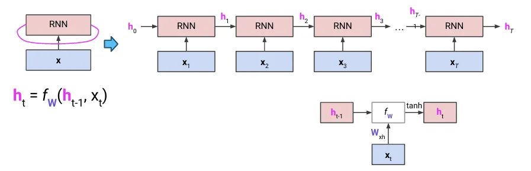

- 장점
    - 가변적 길이의 input sequence 처리 가능
    - 이전 단계의 정보 사용 가능(이론적으로)
    - 모든 단계에서 동일한 가중치 적용 → 파라미터가 적음
- 단점
    - 병렬화 어려움
    - 기울기 소실 문제
    - 장기적 의존성 모델링에 어려움
    - 실제로는 이전 단계 정보에 접근하기 어렵다

⇒ RNN은 완벽하지 않다

1. RNN은 기울기 소실/폭발 문제가 있어서 long-range dependence를 모델링하기 어렵다
    
    **→ LSTM/GRU**
    
2. Many-to-Many RNN은 입/출력 시퀀스의 길이가 다를 때 대응하기 어렵다
    
    **→ Seq2seq 모델**
    
3. LSTM/GRU도 매우 긴 시퀀스를 처리할 때 문제가 발생한다
    
    **→ Attention model**
    

## (1) Gradient 문제

- RNN cell을 자세히 보자.
    
    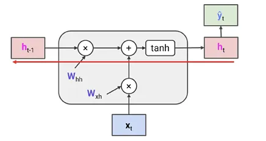
    
    $$\mathbf{h}_t = \tanh(\mathbf{W}_{hh}\mathbf{h}_{t-1} + \mathbf{W}_{xh}\mathbf{x}_t)$$

    $$\frac{\partial \mathbf{h}_t}{\partial \mathbf{h}_{t-1}} = \tanh'(\mathbf{W}_{hh}\mathbf{h}_{t-1} + \mathbf{W}_{xh}\mathbf{x}_t)\mathbf{W}_{hh}$$

    
    ⇒ $h_t$에서 $h_{t-1}$로 backprop시 $W_{hh}$를 곱한다.
    

- 전체에 대한 backprop 수행
    - $\hat{y_t}$ : 각 output
    - $L_t$: loss
    
    $$\begin{aligned}\frac{\partial \mathcal{L}_t}{\partial \mathbf{W}_{hh}} &= \frac{\partial \mathcal{L}_t}{\partial \mathbf{h}_t} \frac{\partial \mathbf{h}_t}{\partial \mathbf{h}_{t-1}} \cdots \frac{\partial \mathbf{h}_2}{\partial \mathbf{h}_1} \frac{\partial \mathbf{h}_1}{\partial \mathbf{W}_{hh}} \\
    &= \frac{\partial \mathcal{L}_t}{\partial \mathbf{h}_t}\left(\prod_{k=2}^t \frac{\partial \mathbf{h}_k}{\partial \mathbf{h}_{k-1}}\right) \frac{\partial \mathbf{h}_1}{\partial \mathbf{W}_{hh}} \\
    &= \frac{\partial \mathcal{L}_t}{\partial \mathbf{h}_t}\left(\prod_{k=2}^t \tanh^{\prime}\left(\mathbf{W}_{hh} \mathbf{h}_{k-1} + \mathbf{W}_{xh} \mathbf{x}_k\right) \mathbf{W}_{hh}\right) \frac{\partial \mathbf{h}_1}{\partial \mathbf{W}_{hh}} \\
    &= \frac{\partial \mathcal{L}_t}{\partial \mathbf{h}_t}\left(\prod_{k=2}^t \tanh^{\prime}\left(\mathbf{W}_{hh} \mathbf{h}_{k-1} + \mathbf{W}_{xh} \mathbf{x}_k\right)\right) \mathbf{W}_{hh}^{t-1} \frac{\partial \mathbf{h}_1}{\partial \mathbf{W}_{hh}}
    \end{aligned}$$
    
    - tanh'가 항상 1 미만이면 → 기울기 소실
    - $W_{hh}$: 동일한 행렬의 반복적인 multiplication
        
        ⇒   가장 큰 특이값 > 1 : 기울기 폭발
        
        가장 큰 특이값 < 1 : 기울기 소실
        

- RNN의 input sequence length는 딥러닝의 depth처럼 작용
    
    → 같은 weight를 쓰기 때문에 gradient가 vanish/explode 될 수 밖에 없다.
    
- 기울기 폭발 → 클리핑으로 해결 가능
    - 클리핑: threshold 보다 커지면 자르기
- 기울기 소실 → LSTM/GRU로 해결하자

### LSTM

- Vanilla RNN
    
    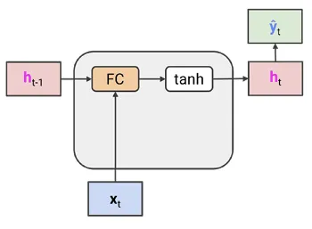
    

FC layer를 통과하는 backward 과정에서 기울기 소실 문제가 발생한다

⇒ cell state & highway 도입해보자

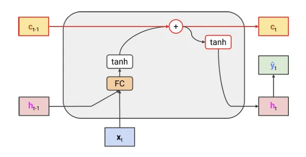

- cell state: 새로운 hidden layer
- input이 FC를 통과하지 않고도 output으로 갈 수 있도록!

⇒ cell state는 장기 기억 장치이다. ⇒ 제어가 필요하다 ⇒ forget gate 도입

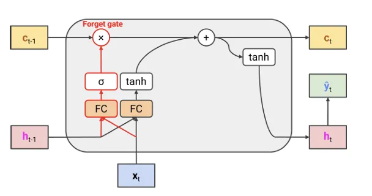

- forget gate: 얼마나 많이 저장될지

⇒ input과 유사하게 input gate 추가 ⇒ 흐름 제어

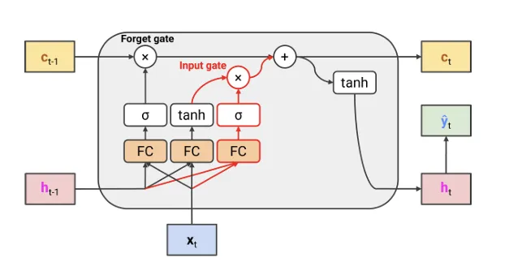

⇒ hidden state $h_t$로 업데이트 되는 값을 제어하기 위해 output gate 추가

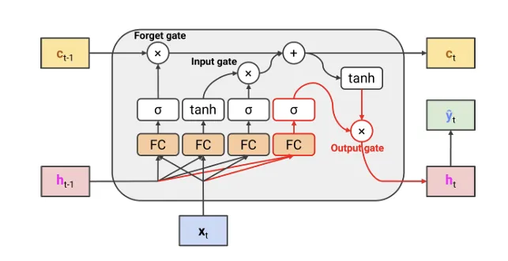

- 최종 결과
    
    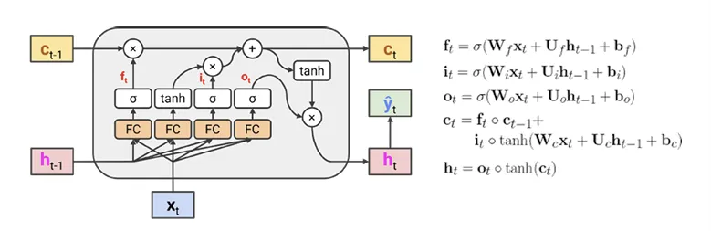
    
    - Forget gate: 얼마나 잊어버릴지
    - Input gate: 얼마나 기록할지
    - Output gate: 어떻게 output을 낼지
    
    ⇒ LSTM은 cell gate와 highway 덕분에 바닐라 RNN보다 long-range information을 더 잘 보존함.
    

### GRU

LSTM 복잡하다! → h를 두 갈래로 나눠서 하나를 cell state처럼 쓸래!

⇒ 더 적은 파라미터 & cell state 필요 X

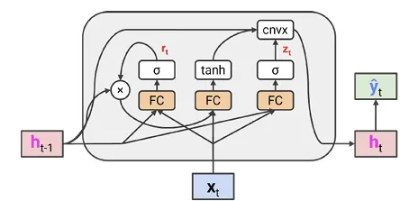

## (2) Many-to-Many RNN

- input 수 = output 수

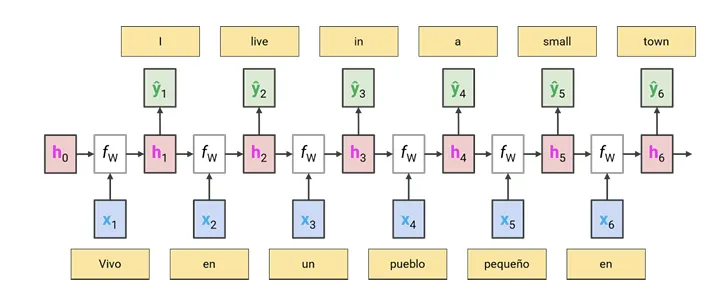

- RNN은 일대일 관계를 가정한다
    
    → Machine translation은 일대일 불가능!
    
- 각 입력 토큰에 대해 출력 토큰 생성 ⇒ 하지 말자!
    
    ⇒ 인코더-디코더 구조 써보자
    

### Seq2seq

**인코더**

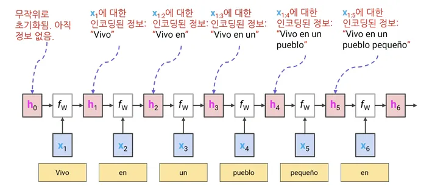

- 문장 전체에 대해 인코딩된 정보를 배운다.
- 시퀀스의 끝인 $h_n$은 전체 시퀀스 $X_{1:n}$을 인코딩한다.
    
    → 전체 입력 시퀀스의 의미를 포하하는 임베딩을 가지고 있다.
    
    → 이 임베딩에서 시작하여 하나씩 출력을 생성하는 디코더를 구축하자
    

**디코더**

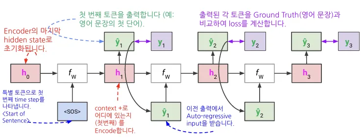

- Auto-Regressive: 전 단계에 예측한 단어를 다음 단계 input으로 넣는다
    - 학습 단계에서는 예측값 대신 실제 값을 넣는다
    - inference 단계에서는 예측 값을 auto regressive 하게 넣는다

인코더: many to one

디코더: one to many

⇒ 길이 상관 X!!

## (3) Attention

### RNN based models의 한계점

- sequence가 길이에 상관없이 single embedding으로 embedding 됨
    
    ⇒ long sequences에서는 information loss가 불가피하다.
    

### Attention

- 아이디어
    - 디코더는 모든 input step에서의 hidden state를 고려하여 관련성이 높은 input token에 더 집중하자!!!

- Attention(Q,K,V)
    - value들의 가중치 평균
    - 가중치: query와 key의 관련성
        - Query(Q): 현재 디코더 상태, 비교 기준
        - Key(K): 인코더의 각 상태, 비교 대상
        - Value(V): 인코더의 각 상태에서 참고할 값, 비교 대상

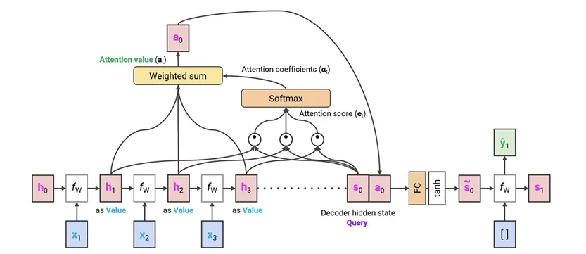

1. Q와 K 사이의 내적 구하기
    - 어떤 input과 output의 hidden state가 가장 유사한지 구하는 것
2. 다 더해서 softmax
3. attention value 구하기

예시

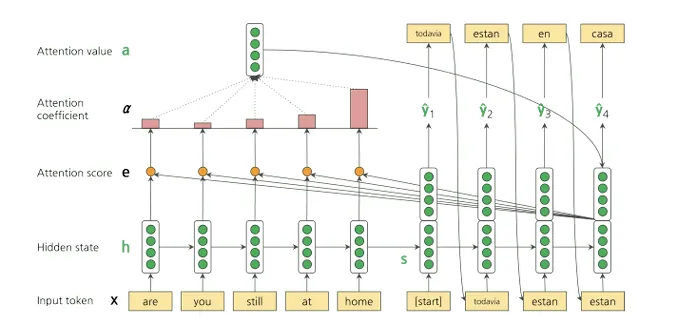

- Q: 디코더의 hidden state $s_0$
- K, V: 인코더의 hidden states $\{h_1,h_2,...\}$
- Attenstion value: encoder hidden states의 가중치 평균

---

# B. [Attention is All You Need](https://arxiv.org/pdf/1706.03762) 논문 리뷰

## Abstract

- 기존의 시퀀스 모델: 인코터-디코터를 포함한 RNN, CNN 기반 모델
- 가장 성능이 좋았던 모델: 인코더-디코더를 Attention으로 연결
- Transformer를 제안한다.
    - RNN이나 CNN 없이 오직 Attention 매커니즘만으로 동작
    - 성능이 좋았다(병렬 처리, 시간 단축, 번역 품질)

## 1. Introduction

- 기존의 시퀀스 모델링에서는 RNN, LSTM, GRU가 최고 성능을 기록했다.
- RNN 기반 모델의 **“순차적 특성”**
    
    → 이전 상태를 바탕으로 다음 상태를 계산한다.
    
    - **병렬 처리 X**(순차적으로 계산해야 해서)
    - 시퀀스 길이가 길어질수록 메모리 제한으로 여러 배치 동시 학습 불가
    
    ⇒ 인수분해 기법, 조건부 연산을 통해 개선하고자 하였으나 순차적 특성이라는 근본적인 제약 존재
    
    ⇒ 어텐션 메커니즘 ㄱㄱ
    
- 어텐션 메커니즘
    - 토큰 간 거리에 관계없이 의존성 모델링 가능
    - 대부분 RNN과 함께 사용됨
- Transformer
    - RNN을 제거하고 어텐션만을 활용
    - 병렬 처리, 더 빠른 학습 속도. 더 좋은 품질

⇒ 즉, Transformer는 기존 RNN 기반 모델의 병렬화 문제를 해결하고, 더 나은 성능을 제공하는 혁신적인 모델이다.

## 2. Background

- 기존의 CNN 기반 모델들
    - 병렬 처리 가능
    - 멀리 떨어진 토큰 간의 관계 학습 어려움
- Transformer
    - 연산이 일정한 수로 줄어듦.
    - Attention 가중치가 평균을 취함 → 해상도가 낮아짐 → Multihead Attention을 사용하자!
    - Self-Attention: 하나의 시퀀스 내에서 서로 다른 위치를 연결하여 시퀀스 표현 계산

Transformer는 RNN이나 CNN 없이 오직 self-attention을 사용한 최초의 모델임

Transformer는 기존 모델들의 병렬화 문제와 긴 거리 의존성 학습 문제를 동시에 해결하는 혁신적인 접근 방식임.

## 3. Model Architecture

- 대부분의 신경만 기반 시퀀스 변환 모델은 인코더-디코더 구조
    - 인코더: 입력 시퀀스 → 연속 표현
    - 디코더: z를 기반으로 출력 시퀀스 하나씩 생성
    
    → 모델은 auto-regressive함.(이전 출력을 다음 출력 생성의 입력으로)
    

### 3.1 Encoder and Decoder Stacks

- 인코더
    - 6개의 레이어(Stacked Layers)로 구성
    - 각 레이어는
        1. **다중 헤드 어텐션(Self-Attention)**
        2. **완전 연결 피드포워드 네트워크(FFN)** 로 구성
    - **잔차 연결 + 레이어 정규화** 사용
    
    → LayerNorm(x+sublayer(x))
    
- **디코더**
    - 인코더와 동일하게 6개의 레이어로 구성
    - 추가적으로 **세 번째 서브 레이어에서 인코더 출력을 기반으로 한 어텐션 수행**
    - 출력 예측 시 현재 위치 이후의 단어는 참고하지 못하도록 **마스킹(masking)** 적용

### 3.2 Attention

- 어텐션 함수
    - query, key, value 벡터로 이루어진 입력을 출력으로 매핑하는 함수
    - 출력: V들의 가중합
    - 가중합: Q와 K 사이의 적합도

**3.2.1 Scaled Dot-Product Attention**

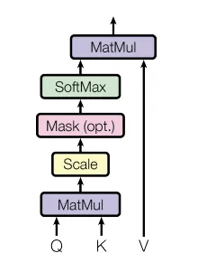

$Attention(Q, K, V ) = softmax(\frac{QK^T}{\sqrt{d_k}})V$

- 쿼리와 키의 내적을 계산 후 $\sqrt{d_k}$ 로 나누어 Softmax를 적용
- Additive Attention과 비교하여 더 빠르고 메모리 효율적
- 내적 값이 너무 커지는 문제를 방지하기 위해 $\frac{1}{\sqrt{d_k}}$로 스케일링

**3.2.2 Multi-Head Attention**

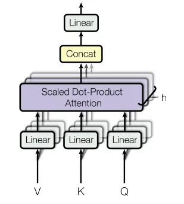

$MultiHead(Q, K, V ) = Concat(head_1, ..., head_h)W^O$

where  $head_i = Attention(QW^Q_i, KW^K_i, VW^V_i)$ 

- 하나의 어텐션을 수행하는 대신,
    - **쿼리, 키, 값을 각각 여러 개의 서로 다른 학습된 선형 변환을 통해 dk, dk, dv 차원으로 투영**
- 여러 개의 독립적인 어텐션을 병렬로 수행하여 **다양한 관점에서 정보를 추출 가능**
    - 서로 다른 표현 하위 공간에서 서로 다른 정보에 동시에 집중할 수 있게
    - 하나의 어텐션에서는 평균화로 인해 불가능
- Transformer의 핵심 요소 중 하나로, 단순한 어텐션보다 더 강력한 표현력을 제공
- 서로 다른 표현 하위 공간에서 정보를 추출
- h=8 개의 병렬 어텐션을 수행
- 각 헤드의 차원을 줄여 전체 계산 비용을 단일 어텐션과 유사하게 유지

**3.2.3 Applications of Attention in our Model**

멀티헤드 어텐션을 세가지 방식으로 사용한다.

1. **인코더-디코터 어텐션**(encoder-decoder attention)
    - 디코더가 인코더 출력을 참고
        - Q: 이전 디코더 층에서
        - K, V: 인코더 출력에서
2. **인코더 내부의 자기 어텐션**(self-attention layers in the encoder)
    - 인코더 내에서 모든 위치가 서로를 참고
        - Q, K, V가 모두 동일한 층에서
3. **디코더 내부의 자기 어텐션**(self-attention layers in the decoder)
    - 미래 정보 유출을 방지하기 위해 마스킹 적용
    

### 3.3 Position-wise Feed-Forward Networks

- 모든 위치에 동일하게 적용되지만, 층마다 다른 매개변수 사용
- **입력(512차원) → 내부(2048차원) → 출력(512차원) 변환**
- **ReLU 활성화 함수를 포함한 두 개의 선형 변환으로 구성**
    
    $FFN(x) = max(0, xW1 + b1)W2 + b2$
    

### 3.4 Embeddings and Softmax

- 입력 및 출력 토큰을 $d_{model}$ **차원의 벡터로 변환하는 임베딩 사용**
- 디코더 출력은 **소프트맥스 변환을 통해 다음 토큰 확률로 변환**
- **입력/출력 임베딩과 소프트맥스 직전 선형 변환 가중치 행렬을 공유** (연산량 감소 및 학습 안정성 증가)
- 임베딩 값에는 $\sqrt{d_{model}}$ **를 곱하여 크기를 조정**

### 3.5 Positional Encoding

- Transformer는recurrence**이나 convolution이 없으므로** 위치 정보를 직접 추가해야 함
- 임베딩과 동일한 차원($d_{model}$)을 가지며, 임베딩 벡터에 더해줌
- 사인코사인 함수를 이용하여 **서로 다른 주파수를 가진 위치 인코딩을 생성**
- 위치 pos 와 차원 i 에 대해 다음과 같이 정의됨
    - $PE_{(pos,2i)}=sin(pos/10000^{2i/d_{model}})$
    - $PE_{(pos,2i+1)}=cos(pos/10000^{2i/d_{model}})$
- **이 방식의 장점**
    - 사인파 성질을 활용하여 **상대적 위치(relative positions) 학습이 용이**
    - 학습되지 않은 긴 시퀀스에 대해 **일반화(extrapolation) 가능**

## 4. Why Self-Attention

Self-Attention은 시퀀스 변환 모델에서 Recurrent 및 Convolutional 층과 비교했을 때 다음과 같은 장점을 가진다.

1. **연산 효율성**
    - 자기-어텐션 층은 **모든 위치를 동시에 연결**하며, 일정한 수의 순차적 연산으로 계산된다.
    - 반면, 순환 층은 **O(n)** 개의 순차적 연산이 필요하여 연산량이 증가한다.
    - 시퀀스 길이 **n이 표현 차원 d보다 작을 때**, 자기-어텐션이 순환 층보다 빠르다.
2. **병렬 처리 가능성**
    - 자기-어텐션은 입력 시퀀스 내 모든 위치를 동시에 계산할 수 있어 **병렬 처리가 가능**하다.
    - 반면, 순환 층은 이전 단계의 출력을 기반으로 계산해야 하므로 병렬화가 어렵다.
3. **장거리 의존성 학습**
    - 자기-어텐션은 **입력 및 출력 시퀀스 내 모든 위치 간의 경로 길이를 일정하게 유지**할 수 있어,
        
        **장거리 의존성을 더 쉽게 학습**할 수 있다.
        
    - 순환 및 합성곱 층은 장거리 의존성을 학습하려면 여러 층을 거쳐야 하므로 경로 길이가 길어진다.
4. **합성곱 층과의 비교**
    - 합성곱 층은 한 번의 연산으로 모든 위치를 연결할 수 없으며, 여러 층을 쌓아야 한다.
    - 분리 가능한 합성곱은 연산량을 줄이지만, 자기-어텐션과 점별 피드포워드 층을 합친 것과 비슷한 복잡도를 가진다.
5. **해석 가능성**
    - 자기-어텐션을 통해 모델이 **문장의 구문적 및 의미적 구조를 학습하는 과정**을 분석할 수 있다.
    - 어텐션 헤드별로 다른 역할을 수행하는 것이 확인되었으며, 이는 모델의 해석 가능성을 높인다.

**➡ 결론:** 자기-어텐션은 **연산 효율성, 병렬 처리 가능성, 장거리 의존성 학습 능력, 해석 가능성** 측면에서 순환 및 합성곱 층보다 우수한 특성을 가진다.

## 5. Training

- **데이터 및 배치**
    - WMT 2014 영-독 번역 데이터(450만 문장)와 WMT 2014 영-불 번역 데이터(3600만 문장) 사용
    - 문장은 BPE(Byte-Pair Encoding)로 토큰화했으며, 배치는 대략 25,000개의 소스 및 타겟 토큰을 포함하도록 구성
- **하드웨어 및 훈련 일정**:
    - 8개의 NVIDIA P100 GPU에서 훈련
    - 기본 모델: 0.4초/스텝, 100,000 스텝(약 12시간)
    - 큰 모델: 1.0초/스텝, 300,000 스텝(약 3.5일)
- **최적화 기법**
    - Adam 옵티마이저 사용(β1=0.9, β2=0.98, ϵ=10⁻⁹). 학습률은 처음 4000 스텝 동안 선형 증가 후, 역제곱근 방식으로 감소
- **정규화 기법**
    - **드롭아웃**: 각 서브레이어의 출력과 임베딩+포지셔널 인코딩에 적용 (기본 모델 Pdrop=0.1)
    - **라벨 스무딩**: εls=0.1 적용하여 모델이 확률값을 더 부드럽게 예측하도록 유도. BLEU 점수 향상 효과 있음

## **6. Results**

- **기계 번역**
    - WMT 2014 영-독 번역에서 Transformer(Big) 모델이 기존 최고 성능 대비 2.0 BLEU 이상 향상(28.4 BLEU)
    - WMT 2014 영-불 번역에서도 41.0 BLEU 기록하며 최고 성능 달성
    - 기존 최고 성능 모델 대비 1/4의 훈련 비용으로 더 나은 결과 달성
- **모델 변형 실험**
    - 어텐션 헤드 수를 조정하면 너무 적거나 많을 경우 성능 저하
    - 어텐션 키 크기 감소 시 성능 저하 → 단순한 내적(dot product)보다 더 정교한 유사도 측정 방법이 필요할 수 있음
    - 모델 크기가 클수록 성능이 좋아짐
    - 포지셔널 인코딩을 학습된 임베딩으로 대체해도 큰 차이 없음
- **영어 구문 분석**
    - Penn Treebank 데이터셋으로 실험한 결과, 기존 RNN 기반 모델보다 우수한 성능 달성
    - 제한된 데이터 환경에서도 기존 최고 성능 모델을 능가
    

## **7. Conclusion**

- Transformer는 완전히 어텐션 기반의 최초의 시퀀스 변환 모델로, 기존의 RNN/ConvNet을 대체할 가능성이 있음
- 기존 RNN/CNN 기반 모델보다 **훈련 속도가 훨씬 빠르며, 번역 성능도 최고 수준**
- 향후 연구 방향
    - 텍스트 이외의 입력/출력(예: 이미지, 오디오, 비디오)에도 적용
    - 더 효율적인 Local Attention 기법 개발
    - 생성 과정을 덜 순차적으로 만들기 위한 연구 진행
    

---

# C. 트랜스포머 구조 및 동작 원리

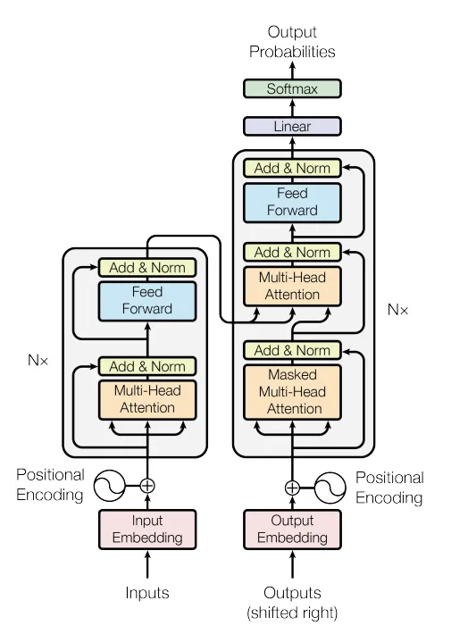

트랜스포머는  인코더-디코더 구조를 기반으로 한다. 

## 1. 입력 단계

- **Input Embedding & Positional Encoding**
    - 입력 토큰을 벡터로 변환하고, 위치 정보를 추가하여 순서를 학습할 수 있도록 함.
    - siusoidal encoding 시각화
    
    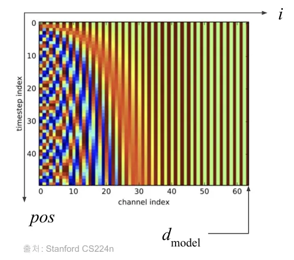
    

## 2. 인코더

- **Multi-Head Attention**: 입력 문장에서 단어 간 관계를 학습
    - 입력을 **쿼리(Q), 키(K), 벨류(V)** 로 변환
    - Q와 K의 내적을 통해 어텐션 가중치를 계산하고, V에 적용하여 중요한 정보 강조
    - 여러 개의 어텐션 헤드를 활용하여 다양한 패턴 학습
    
    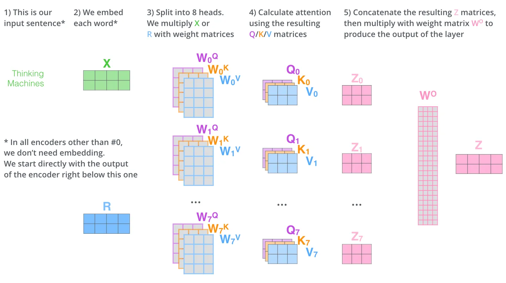
    
- **Add & Norm**
    - 어텐션 결과를 원래 입력에 더한 후 **Layer Normalization** 수행
- **Feed Forward**
    - 완전연결층을 통해 비선형 변환 수행
- **Add & Norm**
    - 다시 정규화
- 위 과정을 **N번 반복**하여 최종 인코더 출력을 생성

## 3. 디코더

- **Output Embedding & Positional Encoding**
    - 목표 문장을 임베딩하고, 위치 정보를 추가하여 순서를 학습
- **Masked Multi-Head Attention**
    - 현재까지의 단어만 참고하도록 **마스킹** 적용
        - 입력을 **Q, K, V** 로 변환하여 어텐션 수행
- **Add & Norm**: 정규화 수행
- **Multi-Head Attention (인코더-디코더 어텐션)**:
    - 인코더 출력을 참고하여 번역 수행
    - **Q는 디코더에서, K와 V는 인코더에서 생성**
- **Add & Norm**: 정규화 수행
- **Feed Forward**: 비선형 변환 적용
- **Add & Norm**: 정규화 수행
- 위 과정을 **N번 반복**하여 디코더의 최종 출력 생성.

## 4. 출력 단계

- **Linear & Softmax**
    - 선형 변환 후 Softmax 함수 적용하여 확률이 가장 높은 단어 선택

---

# 참고 자료

[The Illustrated Transformer – Jay Alammar – Visualizing machine learning one concept at a time.](https://jalammar.github.io/illustrated-transformer/)